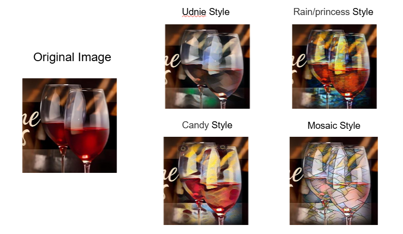
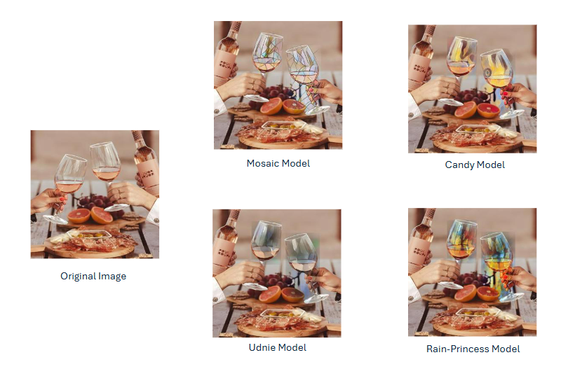

# Wine Glass Detection & Neural Style Transfer

A complete deep learning pipeline built for a university Deep Learning course — from raw data collection through CNN classification, object detection, and creative neural style transfer.

**Team:** Ananya Prabhu · Rimmi Bhadani · Jiao Chen · Inoka Ranatunge · Methruchi Peiris  
**Course:** Deep Learning Final Project — TUAS

---

## Pipeline Overview

```
Raw Images → CNN Classifier → YOLOv5 Detection → Neural Style Transfer
```

---

## Repository Structure

```
CNN_YOLO_StyleTransfer/
│
├── CNN_Optimization_Diagnosis.ipynb        # Custom CNN training & diagnosis
├── Style_Transfer.ipynb                    # YOLO-guided style transfer
│
├── data.yaml                               # YOLOv5 dataset config (Roboflow)
├── wineglass_classifier.h5                 # Trained CNN weights
│
└── Deep_Learning_Final_Report.pdf
```

---

## Milestone 1 — Data Collection

220 images total:
- **100** self-captured (varied lighting, backgrounds, angles)
- **100** sourced online (product shots, lifestyle, open datasets)
- **20** negative examples — cups, bottles, plates

All images standardised to 300–500 KB before annotation.

---

## Milestone 2 — CNN Binary Classifier

A custom CNN trained to classify *wine glass* vs *not a wine glass*.

**Architecture**

| Layer | Config |
|---|---|
| Input | 128 × 128 × 3 |
| Conv1 + Pool | 16 filters, 3×3, ReLU |
| Conv2 + Pool | 32 filters, 3×3, ReLU |
| Conv3 + Pool | 64 filters, 3×3, ReLU |
| Conv4 + Pool | 128 filters, 3×3, ReLU |
| Dense | 128 units, ReLU |
| Output | 1 unit, Sigmoid |

**Training iterations**

| Configuration | Train Acc | Val Acc | Notes |
|---|---|---|---|
| Baseline (10 epochs) | 90% | ~90% | High bias |
| 50 epochs, 4 conv layers | 100% | 93.3% | 6.7% variance |
| + Early stopping (patience=8) | 90% | 90% | Bias returned |
| + L2 reg + Dropout(0.5) + LR=1e-4 + 100 epochs | 99.4% | 90% | Best result |

**Final test metrics:** Accuracy 1.0 · Precision 1.0 · Recall 1.0

Weights saved to `wineglass_classifier.h5`.

---

## Milestone 3 — YOLOv5 Object Detection

Fine-tuned **YOLOv5s** on a Roboflow-annotated dataset.

**Dataset split**

| Split | Images |
|---|---|
| Train | 154 |
| Validation | 44 |
| Test | 22 |

**Training**

```bash
python train.py --img 640 --batch 16 --epochs 50 --data data.yaml --weights yolov5s.pt
```

Training time: ~1.3 hours.

```bash
python detect.py --weights runs/train/exp/weights/best.pt --source test/images
```

**Results**

| Metric | Value |
|---|---|
| Precision | 0.955 |
| Recall | 0.844 |
| mAP@0.5 | 0.919 |
| Parameters | 7,012,822 |

Confidence scores consistently above 0.90.

---

## Milestone 4 — Neural Style Transfer

YOLO bounding boxes isolate the wine glass region, a pretrained style model is applied, and the result is blended back into the original image.

**Pipeline**

1. Parse YOLO `.txt` labels (normalised `class x_center y_center width height`)
2. Convert to pixel coordinates and crop the wine glass
3. Resize to satisfy TransformerNet (dimensions divisible by 4)
4. Single forward pass through pretrained `TransformerNet`
5. Resize styled patch back to original bounding box size
6. Blend via Gaussian soft mask for smooth edges

**Style models**

| Model | Style |
|---|---|
| `mosaic.pth` | Mosaic / stained glass |
| `candy.pth` | Impressionist |
| `udnie.pth` | Abstract expressionist |
| `rain_princess.pth` | Painterly |

---

## Results

 
---
 

---

## Setup

```bash
pip install torch torchvision pillow numpy
```

For YOLOv5:

```bash
git clone https://github.com/ultralytics/yolov5
cd yolov5
pip install -r requirements.txt
```
